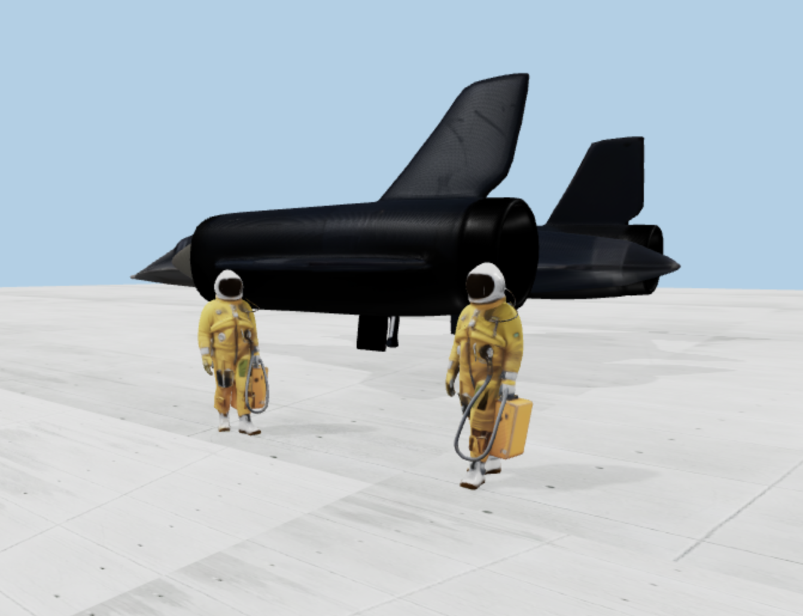

## 3D Playground
An experimental platform to generate and view 3D models



## Getting Started

### Installation

1. Clone the repository
2. Navigate to the project directory:
   ```bash
   cd 3D_Playground/playground
   ```
3. Install dependencies:
   ```bash
   npm install
   ```

### Setting up Fal API Key

1. Sign up for a Fal account at [https://fal.ai](https://fal.ai)
2. Get your API key from the [Fal Dashboard](https://fal.ai/dashboard/keys)
3. Create a `.env.local` file in the project root and add your API key:
   ```bash
   FAL_API_KEY=your_api_key_here
   ```

### Running the Development Server

1. Start the development server:
   ```bash
   npm run dev
   ```
2. Open [http://localhost:3000](http://localhost:3000) in your browser
